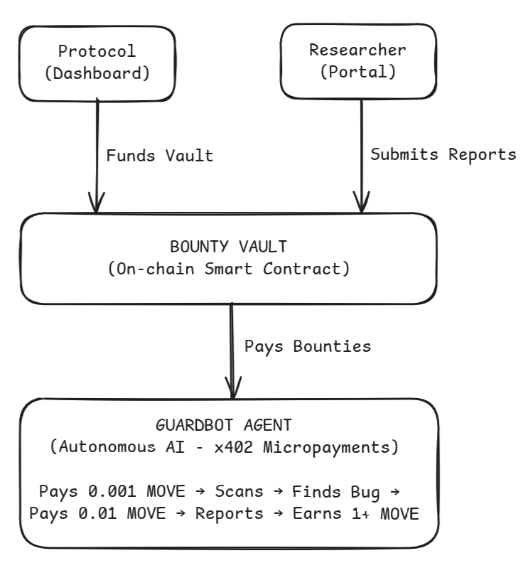

# MoveGuard

**Autonomous AI Security Agent for DeFi on Movement Network**

> Protocols fund bounty vaults. GuardBot finds the bugs first. Security that pays for itself.

[](https://movementnetwork.xyz)
[](https://x402.org)
[](https://privy.io)

---

## The Problem

**DeFi protocols lost $3.8 billion to hacks in 2022 alone.**

Current security approaches are fundamentally broken:

- **Reactive, not proactive**: By the time a human detects an attack, funds are already gone
- **One-time audits**: Security reviews happen once, then protocols hope for the best
- **Expensive**: Traditional audits cost $50K-$500K and become outdated with every code change
- **No 24/7 coverage**: Protocols can't afford dedicated security teams watching around the clock

---

## The Solution

**MoveGuard is an autonomous AI security agent that monitors DeFi protocols 24/7, detects threats in real-time, and can pause contracts before exploits happen.**

### How It Works



---

## Three Integrated Portals

### 1. Protocol Dashboard (`/dashboard`)
**For: DeFi Protocol Teams**

- Register your smart contracts for protection
- Choose protection model: Subscription (payment streams) or Bounty (fund vault)
- Run AI-powered threat analysis with real-time results
- Emergency pause contracts when critical threats detected
- View threat levels and protection status

### 2. GuardBot Agent (`/guardbot`)
**For: Autonomous AI Security**

- AI agent with its own Privy-embedded wallet
- Monitors protocols without human intervention
- Pays for AI analysis via x402 micropayments (0.001 MOVE/scan)
- Auto-submits vulnerability reports (0.01 MOVE/report)
- Claims bounties when bugs are validated (1-5 MOVE)
- **Self-sustaining economics**: Spends 0.011 MOVE, earns 1+ MOVE per bug

### 3. Researcher Portal (`/researcher`)
**For: Human Security Researchers**

- Submit vulnerability reports for bounty-protected protocols
- Tiered bounty system based on severity:
  - Low: 0.1 MOVE
  - Medium: 0.5 MOVE
  - High: 1.0 MOVE
  - Critical: 5.0 MOVE
- Track report status: Pending → Validated → Paid
- Instant bounty claims from protocol vaults

---

### GuardBot Bounty Architecture

GuardBot is an autonomous AI security agent that operates with its own wallet, paying for services and earning bounties without human intervention.


**Key Components:**
- **Privy Embedded Wallet**: Agent has its own wallet for autonomous transactions
- **x402 Micropayments**: Pays 0.001 MOVE per AI scan, 0.01 MOVE per report
- **BountyVault Integration**: Claims rewards directly from protocol vaults
- **Self-Sustaining Economics**: Spends ~0.011 MOVE per bug, earns 1-5 MOVE in bounties

---

## Product Market Fit

### The Market Opportunity

| Problem | Traditional Solution | MoveGuard Solution |
|---------|---------------------|-------------------|
| Security is expensive | $50K-$500K audits | Pay-for-results bounties |
| Audits become outdated | Re-audit on every change | Continuous 24/7 monitoring |
| No real-time protection | Post-mortem analysis | Proactive auto-pause |
| Human bottleneck | Limited security researchers | AI + human researcher marketplace |

### Why We Win

- **Pay-for-results**: Protocols only pay when bugs are actually found
- **Autonomous**: No human security team required for monitoring
- **Affordable**: Bounty model aligns costs with value delivered
- **Proactive**: Stop exploits before they happen, not after
- **Scalable**: AI agent can monitor unlimited protocols simultaneously

### Why Movement Network

- **Low gas costs**: Micropayments (0.001 MOVE) are viable without being eaten by fees
- **Move language**: Resource model enables programmatic contract pausing
- **Growing ecosystem**: DeFi protocols need security infrastructure as TVL grows
- **x402 support**: Native micropayment protocol for autonomous agent economics

---

## Business Model

### Revenue Streams

| Stream | Amount | Description |
|--------|--------|-------------|
| **Platform Fee** | 10% | On every bounty payout |
| **Submission Fee** | 0.01 MOVE | Per vulnerability report (spam prevention) |
| **Analysis Fee** | 0.001 MOVE | Per AI threat scan via x402 |

### Unit Economics

```
Protocol Cost:
└── Fund bounty vault (only upfront cost)
└── Bounties paid only when real bugs found

GuardBot Economics:
└── SPENDS: 0.001 MOVE/scan + 0.01 MOVE/report = 0.011 MOVE
└── EARNS:  1-5 MOVE per valid bug found
└── MARGIN: ~99% profit on successful finds

Platform Economics:
└── 10% of all bounty payouts
└── Scales linearly with ecosystem adoption
```

### Why This Works

1. **Aligned incentives**: Everyone profits when bugs are found before hackers
2. **Self-sustaining agent**: GuardBot earns more than it spends
3. **Low barrier to entry**: Protocols fund vaults, that's their only cost
4. **Network effects**: More protocols = more bounties = more researchers/agents

---

## Key Features

### x402 Micropayments
- Agent pays for its own AI analysis autonomously
- Real on-chain MOVE transfers for every scan
- No human approval needed for each transaction
- Demonstrates true autonomous agent economics

### Privy Embedded Wallets
- One-click agent deployment with auto-created wallet
- No seed phrases to manage or expose
- Clean UX hiding blockchain complexity
- Server-side signing for seamless transactions

### AI Threat Detection (ATXP)
- Real-time analysis of contract code and transaction patterns
- Trained on known DeFi attack patterns:
  - Flash loan attacks
  - Oracle manipulation
  - Reentrancy vulnerabilities
  - Sandwich/MEV attacks
- Confidence scoring with specific indicators

### On-Chain Auto-Pause
- Threats ≥75% trigger automatic contract pause
- Oracle pattern: Only authorized signer can trigger
- Events emitted for transparency
- Admin can unpause after review

### Instant Bounty Payouts
- No weeks of review—claim immediately when validated
- Direct transfer from protocol's bounty vault
- Tiered rewards based on severity
- Transparent on-chain transactions

---

## Architecture

### Smart Contracts

```
Module: 0x75af640152814da05efaa231640b06d253780551d584a9e81cbd6c3f7b1081ef

├── guardian.move       - Protocol registration, threat tracking, auto-pause
├── bounty_vault.move   - Multi-protocol bounty system with report lifecycle
└── payment_stream.move - x402 subscription payment infrastructure
```

### Auto-Pause Flow

```
1. GuardBot monitors protocol via /api/threats/analyze
                    ↓
2. ATXP AI analyzes for threats (0-100% threat level)
                    ↓
3. Threat Level >= 75%? ──NO──→ Return assessment only
        │
       YES
        ↓
4. Auto-trigger guardian::trigger_pause on-chain
        ↓
5. Smart contract sets is_paused = true
        ↓
6. Protocol operations blocked until admin unpause
```

---

## Tech Stack

| Layer | Technology |
|-------|------------|
| **Frontend** | Next.js 14 (App Router), TypeScript, Tailwind CSS, Framer Motion |
| **Auth** | Privy embedded wallets (email, Google, Twitter, GitHub, Discord) |
| **Blockchain** | Movement Bardock Testnet (Chain ID: 250) |
| **AI** | ATXP AI Gateway (OpenAI-compatible SDK) |
| **Payments** | x402 protocol with micropayment streams |
| **UI** | shadcn/ui components |

---

## Getting Started

### Prerequisites

- Node.js 18+
- pnpm (recommended) or npm

### Installation

```bash
# Clone the repository
git clone https://github.com/yourusername/moveguard.git
cd moveguard

# Install dependencies
pnpm install

# Copy environment variables
cp .env.example .env.local
```

### Environment Variables

```bash
# Privy
NEXT_PUBLIC_PRIVY_APP_ID=your_privy_app_id

# Movement Network
NEXT_PUBLIC_MOVEMENT_RPC=https://testnet.movementnetwork.xyz/v1
NEXT_PUBLIC_MODULE_ADDRESS=0x75af640152814da05efaa231640b06d253780551d584a9e81cbd6c3f7b1081ef

# ATXP AI
ATXP_CONNECTION=https://accounts.atxp.ai?connection_token=<token>&account_id=<id>

# Deployer (for server-side signing)
DEPLOYER_PRIVATE_KEY=your_private_key
```

### Development

```bash
# Run development server
pnpm dev

# Open http://localhost:3000
```

### Build

```bash
# Build for production
pnpm build

# Start production server
pnpm start
```

---

## Using The Application

### Dashboard (Subscription-Based Protection)

**For Protocol Teams** - Continuous monitoring with payment streams

1. **Register Protocol**: Click "Register Protocol" → Enter contract name and address
2. **Create Payment Stream**: Click "Activate Stream" → Deposit initial MOVE (min 0.1 MOVE)
3. **Run Threat Analysis**:
   - Click "Analyze Threats" on your protocol card
   - Select attack type (Flash Loan, Oracle, Sandwich, Reentrancy)
   - Pay 0.001 MOVE via x402 micropayment
   - View AI-powered threat assessment (0-100% threat level)
4. **Monitor Status**: Dashboard shows real-time threat levels and protection status
5. **Auto-Pause**: If threat level ≥75%, protocol is automatically paused on-chain
6. **Emergency Pause**: Manually pause anytime via "Emergency Pause" button
7. **Add Funds**: Click "Add Funds" to top up your payment stream
8. **Unpause**: After reviewing threat, click "Unpause" to resume operations

**Bounty Protection Alternative**: Click "Register for Bounty Protection" to use the bounty model instead (deposit funds to vault, researchers earn bounties for finding bugs)

### GuardBot (Autonomous Agent)

**For Automated Security** - AI agent that pays, scans, and earns autonomously

1. **Initialize**: Click "Run Demo" → GuardBot wallet created via Privy
2. **Pay for Analysis**: GuardBot pays 0.001 MOVE for AI scan (visible on-chain)
3. **Detect Threat**: AI identifies vulnerability (85%+ threat level)
4. **Auto-Report**: GuardBot pays 0.01 MOVE to submit report
5. **Claim Bounty**: GuardBot claims 1+ MOVE from vault
6. **Result**: Agent spent 0.011 MOVE, earned 1+ MOVE = profitable

### Researcher Portal

**For Security Researchers** - Submit vulnerabilities and earn bounties

1. **Browse Protocols**: See bounty-protected protocols and vault balances
2. **Submit Report**: Fill vulnerability details, pay 0.01 MOVE fee
3. **Track Status**: Watch report go from Pending → Validated
4. **Claim Bounty**: Instant payout based on severity tier (0.1 - 5 MOVE)

---

## Project Structure

```
moveguard/
├── app/                      # Next.js App Router
│   ├── page.tsx              # Landing page
│   ├── dashboard/            # Protocol admin dashboard
│   ├── guardbot/             # Autonomous agent interface
│   ├── researcher/           # Researcher portal
│   └── api/                  # API routes
│       ├── threats/          # AI threat analysis
│       ├── bounty/           # Bounty operations
│       ├── guardbot/         # Agent monitoring
│       └── x402/             # Payment processing
├── components/
│   ├── ui/                   # shadcn/ui components
│   ├── dashboard/            # Dashboard components
│   ├── guardbot/             # Agent components
│   ├── researcher/           # Researcher components
│   └── shared/               # Shared components
├── contracts/                # Move smart contracts
│   └── sources/
│       ├── guardian.move
│       ├── payment_stream.move
│       └── bounty_vault.move
├── lib/                      # Utilities
│   ├── movement.ts           # Movement SDK
│   ├── atxp-ai.ts            # AI integration
│   ├── x402.ts               # Payment utilities
│   └── signer.ts             # Transaction signing
└── hooks/                    # React hooks
    ├── useProtocols.ts
    ├── useGuardBot.ts
    ├── useX402Payment.ts
    └── useBountyProtocols.ts
```

---

## Roadmap

| Phase | Milestone |
|-------|-----------|
| **Now** | Working testnet demo with autonomous agent |
| **Next** | Mainnet deployment, first protocol integrations |
| **Growth** | 10+ protocols with funded bounty vaults |
| **Scale** | Multiple GuardBot instances, researcher leaderboards |
| **Expansion** | Multi-chain support (Aptos, Sui) |

---

## Differentiators

| Feature | MoveGuard | Competitors |
|---------|-----------|-------------|
| Agent Economics | Self-sustaining (pays & earns) | Requires human funding |
| Autonomous Payments | Agent pays via x402 | Manual triggers |
| Real-time Detection | AI + auto-pause | Post-hack analysis |
| Instant Bounties | Claim in one click | Weeks of review |
| Embedded Wallets | Privy (agent owns wallet) | MetaMask required |

---

## Links

- **Deployed Contract**: [`0x75af640152814da05efaa231640b06d253780551d584a9e81cbd6c3f7b1081ef`](https://explorer.movementnetwork.xyz/account/0x75af640152814da05efaa231640b06d253780551d584a9e81cbd6c3f7b1081ef?network=bardock+testnet)
- **Network**: Movement Bardock Testnet (Chain ID: 250)
- **Explorer**: [Movement Explorer](https://explorer.movementnetwork.xyz/?network=bardock+testnet)

---

## License

MIT

---

*Built for Movement Hackathon 2025*
